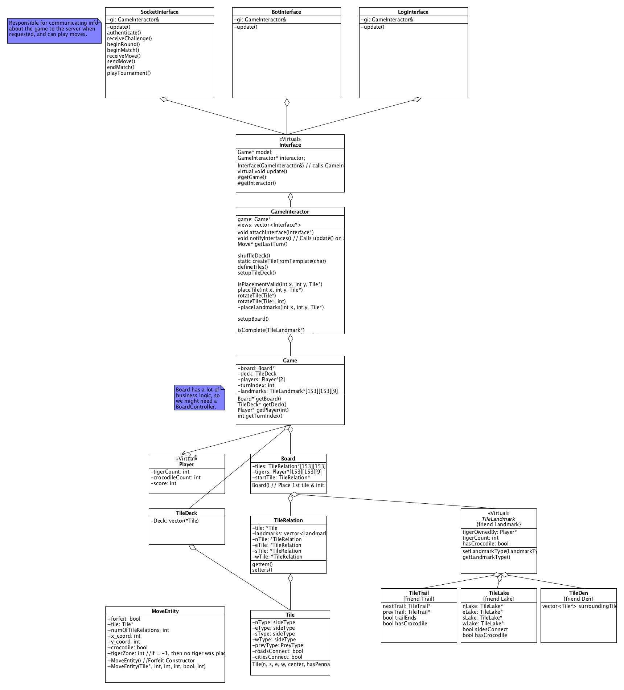

# TigerZone Group X  
## Members  
* Chris Anderson
* Connor Elkin
* Jacob Gonzales
* Will Hsiung

## Architecture and design  
Our UML Diagram of our architecture, designed as a clean architecture with only inward pointing dependences (Adapters → Use Cases → Entities).

## How to build  
You will need to have boost installed in your `/usr/local` (can be changed by replacing `/usr/local` with the appropriate path in the makefile. On OS X with homebrew, all you need to do is run `brew install boost`.

Run `make` in the project directory

## How to run  
Run `build/Release/TigerZoneX <IP> <PORT> <TOURNAMENT_PASSWORD> <TEAM_USERNAME> <TEAM_PASSWORD>`

## How to run tests  
Run `build/Release/TestTigerZoneX`

Our current tests are made to test the units and acceptance of our entities and use cases (located in models/ and interactors/ respectively)

## Known issues will be listed in the issue tracker